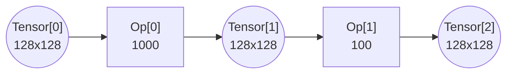
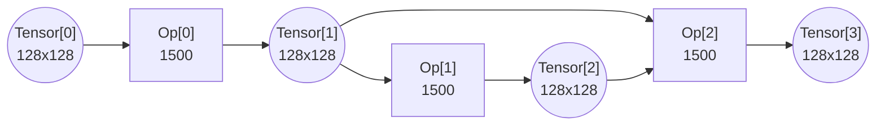
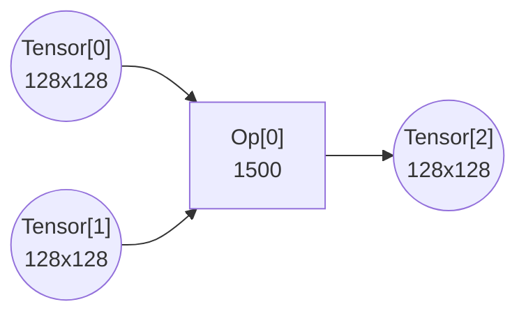
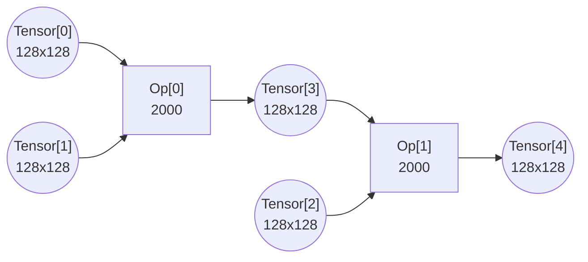

# Important Dates

| Date | Event |
| :---- | :---- |
| 01/22/2026 | Public launch • Call for participation • Open registration • Release starter kit |
| 02/09/2026 | Release 5 benchmark sets |
| 02/15/2026 | Registration deadline |
| 04/24/2026 | Track A and Track B submission deadline (11:59 PM PT) |
| 05/01/2026 | Writeup deadline (11:59 PM PT) |
| 05/11/2026 | Notify winners |
| 05/17/2026 \- 05/22/2026 | MLSys 2026 \- award ceremony |

# Problem Description

Executing massive computational graphs on hardware with limited on-chip memory is one of the fundamental challenges in modern high-performance computing. When the tensors in a workload are orders of magnitude larger than the accelerator's fast memory, the system cannot simply "load and run." Instead, a complex dance of data movement must be orchestrated, breaking the computation into manageable pieces that fit within the hardware's strict physical constraints.

Your objective is to design a scheduler that analyzes a Directed Acyclic Graph (DAG) of operations and generates an execution strategy that minimizes total latency while respecting all memory capacity limits.

## The Memory Hierarchy

The system is modeled with a classic two-level hierarchy consisting of some slow memory and some fast memory. The slow memory has effectively infinite capacity, but moving data to and from it is expensive and consumes limited bandwidth. In contrast, the fast memory is a high-speed scratchpad where computation actually happens, but it has a hard capacity limit. To execute any operation, the necessary input data must be moved to the fast memory, processed by the compute cores, and the results moved back. Because the fast memory is small, we may not be able to process entire tensors at once; we may need to decompose the workload.

## The Compute Capability

To offset the potentially strict memory limitations, the hardware features a powerful subgraph execution engine. This allows you to execute a sequence of connected operations as a single group, or "subgraph." When operations are grouped into a subgraph, the intermediate data flowing between them becomes ephemeral, passing directly from one operation to the next without ever consuming valuable fast memory.

### Execution Granularity

To maximize performance, you must define exactly how the hardware slices the computation for each subgraph. This is controlled by a 3D configuration tuple `[w, h, k]`. This single configuration creates a unified execution grid that every operation in the subgraph must conform to.

The first two dimensions, `w` and `h`, define the spatial granularity. These values dictate the size of the output slice (`w x h`) produced by the subgraph. Whether the operation is a matrix multiplication or a simple pointwise operation, the hardware will process data in spatial slices of this size to maintain grouping compatibility.

The third dimension, `k`, defines the reduction depth. This is primarily for MatMul operations, where the hardware must compute a dot product over a potentially large inner dimension (`K`). For MatMul, the hardware processes the dot product in steps of size `k`. If `k` is smaller than the full reduction dimension, the system automatically enters an "output stationary" mode. It locks the output slice in the fast memory as an accumulator and iterates through the input matrices in slices per the granule, paying the compute cost for each step. For Pointwise operations, since they have no reduction dimension, `k` is ignored (effectively treating it as 1), and the operation simply executes once per spatial tile.

## The Execution Model

For every computation iteration, the system executes at your specified execution granularity. A slice of input data is loaded into the fast memory, the computation is performed, and the output slice is written back. This creates the primary physical constraint of the problem: The Working Set Limit. For any chosen execution granularity, the sum of the required input slices and the resulting output slices must fit simultaneously within the fast memory capacity. If the working set exceeds this limit, the execution will crash with an Out-Of-Memory (OOM) error.

Note that the hardware has a native execution granularity (e.g., 128x128). While you may choose a finer granularity to fit data into memory, the compute cores cannot physically process chunks smaller than this native size. If you select a granularity smaller than the native size, the hardware 'pads' the execution, meaning you pay the full compute cost of the native size but produce less useful output, thereby increasing the total number of execution steps required.

### Modeling Simplification for Experts

This problem uses an abstract hardware model to focus on scheduling logic rather than low-level cycle counting. First, regarding effective capacity, we treat `fast_memory_capacity` as the effective usable space for a single logical working set. We assume the hardware manages any additional physical overheads (like double-buffering) transparently. Second, regarding strict serialization, while the hardware pipelines operations within a subgraph to hide latency, we enforce strict serialization between subgraphs. This means subgraph N+1 cannot begin its memory operations until subgraph N has fully completed both its computation and memory transfers.

## The Objective

Performance is determined by a throughput-oriented roofline model. For every execution step of a subgraph, the latency is dictated by the bottleneck resource: either the time required to perform the arithmetic (compute bound) or the time required to transfer the boundary data (memory bound). However, execution between distinct subgraphs is strictly serialized; the next subgraph in the schedule begins its memory operations only after the previous subgraph has fully completed both its computation and memory transfers.  
Your task is to produce a valid execution schedule \- a complete list of subgraphs and their respective execution granularity \- that covers every operation in the graph at least once, while minimizing the sum of these latencies.

## Input / Output Format

### Input

The problem is specified in a JSON file containing the graph topology and hardware specs. Specifically, `tensor[i]` is a graph input if no operation produces it, and `tensor[j]` is a graph output if no operation consumes it. At the beginning of the computation, all graph inputs already reside in the slow memory. At the end of the computation, all graph outputs need to reside in the slow memory.

```json
{
  "widths": [128, 128, ...],       // width of tensor[i]
  "heights": [128, 128, ...],      // height of tensor[i]
  "inputs": [[0, 1], ...],         // inputs[k] is a list of tensor indexes consumed by Operation[k]
                                   // Note: For MatMul, order matters (Left, Right)
  "outputs": [[2], ...],           // outputs[k] is a list of tensor ids produced by Operation[k]
  "base_costs": [1000, 500, ...],  // base_costs[k] is the cost of Operation[k]
  "op_types": ["MatMul", "Pointwise"], // The type of Operation[k]
  "fast_memory_capacity": 25000,
  "slow_memory_bandwidth": 10,
  "native_granularity": [128, 128] // Hardware native execution granularity [w, h]
}
```

### Output

You must provide a JSON object containing parallel lists that define the execution schedule.

```json
{ 
  "subgraphs": [
    [0, 1], // Step 1: Group nodes 0 and 1
    [2]     // Step 2: Run node 2 
  ],
  "granularities": [
    [64, 64, 128], // Step 1: MatMul (64x64 output, 128 depth) 
    [128, 128, 1]  // Step 2: Pointwise (128x128 output, k=1)
  ],
  "traversal_orders": [ // OPTIONAL: Permutation of slice indices
    [0, 1, 3, 2],       // Step 1: Custom "Snake" order
    null                // Step 2: Default (Raster) [0, 1, 2, 3...] 
  ],
  "subgraph_latencies": [ // REQUIRED: The calculated latency for each step
    2048.0, 
    1024.0
  ]
}
```

Regarding the “granularities” list, the `[w, h, k]` tuple acts as a master key that deterministically sets the shape of all inputs required by the subgraph (recalling that width corresponds to columns and height corresponds to rows). The output and pointwise input will both have width `w` and height `h`. For MatMul inputs, the Left-Hand Side (LHS) input requires width `k` (reduction depth) and height `h`, while the Right-Hand Side (RHS) Input requires width `w` and height `k`.

Regarding the “traversal\_orders” list, when you choose a spatial granularity `(w, h)` smaller than the output tensor, the system implicitly creates a grid of tiles indexed in Row-Major (Raster) Order. For example, a `128x128` tensor with `64x64` granularity creates indices 0 (top-left), 1 (top-right), 2 (bottom-left), and 3 (bottom-right). The “traversal\_orders” field allows you to specify the exact sequence of execution (e.g., `[0, 1, 3, 2]`) to optimize data reuse (like a "Snake" pattern). If omitted, the system defaults to Raster order.

Regarding the “subgraph\_latencies” list, you must provide the total latency for that schedule entry. If a chosen granularity implies multiple tiles (e.g., 4 spatial tiles or 4 split-k steps), the reported latency must be the sum of all those steps.

## Examples

This section provides five examples to demonstrate the core trade-offs of the challenge.

### Example 1: Baseline

````

````

Input

```json
{
  "widths": [128,128,128],
  "heights": [128,128,128],
  "inputs": [[0], [1]],
  "outputs": [[1], [2]],
  "base_costs": [1000, 100],
  "op_types": ["Pointwise","Pointwise"],
  "fast_memory_capacity": 35000,
  "slow_memory_bandwidth": 10,
  "native_granularity": [128, 128]
}
```

#### 

#### Strategy A: Always Spill to Slow Memory

Output

```json
{
  "subgraphs":[[0],[1]],
  "granularities": [[128,128,1],[128,128,1]],
  "traversal_orders": [null, null],
  "subgraph_latencies": [3276.8, 3276.8]
}
```

* Compute: efficient. The execution granularity (`128x128`) is the same as the hardware’s native granularity (`128x128`) .  
* Subgraph 0:  
  * Move `Tensor0` from the slow memory to the fast memory. `MemoryTime0_in = Tensor0/B = 128x128/10 = 1638.4`  
  * Run `Op0`. `ComputeTime0 = Op0 = 1,000`  
  * Evict `Tensor1` from the fast memory to the slow memory. `MemoryTime0_out = Tensor1/B = 128x128/10 = 1638.4`  
  * `TotalLatency0 = max(ComputeTime0, MemoryTime0_in+MemoryTime0_out) = 3,276.8`  
* Subgraph 1:  
  * Move `Tensor1` from the slow memory to the fast memory. `MemoryTime1_in = Tensor1/B = 128x128/10 = 1638.4`  
  * Run `Op1`. `ComputeTime1 = Op1 = 100`  
  * Evict `Tensor2` from the fast memory to the slow memory. `MemoryTime1_out = Tensor2/B = 128x128/10 = 1638.4`  
  * `TotalLatency1 = max(ComputeTime1, MemoryTime1_in+MemoryTime1_out) = 3,276.8`  
* Graph total:  
  * `TotalLatency = TotalLatency0+TotalLatency1 = 3,276.8 + 3,276.8 = 6,553.6` (Memory Bound).

#### 

#### Strategy B: Mega-Group with Large Granularity (128 x 128\)

Output: 

```json
{
  "subgraphs":[[0,1]],
  "granularities": [[128,128,1]],
  "traversal_orders": [null],
  "subgraph_latencies": [3276.8]
}
```

* Compute: efficient. The execution granularity (`128x128`) is the same as the hardware’s native granularity (`128x128`).  
* Subgraph0:  
  * Move `Tensor0` from the slow memory to the fast memory. `MemoryTime0_in = Tensor0/B = 128x128/10 = 1638.4`  
  * Group and run `Op0` and `Op1`.  `ComputeTime0 = Op0+Op1 = 1,000+100 = 1,100`  
  * Evict `Tensor2` from the fast memory to the slow memory. `MemoryTime0_out = Tensor2/B = 128x128/10 = 1638.4`  
  * `TotalLatency0 = max(ComputeTime0, MemoryTime0_in+MemoryTime0_out) = 3,276.8`  
* Graph total:  
  * `TotalLatency = TotalLatency0 = 3,276.8` (Memory Bound, but 2X faster than Strategy A).

#### 

#### Strategy C: Mega-Group with Small Granularity (64 x 64\)

Output: 

```json
{
  "subgraphs":[[0,1]],
  "granularities": [[64,64,1]],
  "traversal_orders": [null],
  "subgraph_latencies": [4400.0]
}
```

* Compute: inefficient. Because the granularity is small, a `128x128` pointwise op now takes 4 passes to fully compute on `64x64` granularity.  
* Subgraph0:  
  * Now has to execute 4 times. Each time:  
    * Move `¼` `Tensor0` from the slow memory to the fast memory. `MemoryTime0_in = ¼ Tensor0/B = 64x64/10 = 409.6`  
    * Group and run `Op0` and `Op1`.  `ComputeTime0 = Op0+Op1 = 1,000+100 = 1,100`  
    * Evict `¼` `Tensor2` from the fast memory to the slow memory. `MemoryTime0_out = ¼ Tensor2/B = 64x64/10 = 409.6`  
  * `TotalLatency0 = max(ComputeTime0, MemoryTime0_in+MemoryTime0_out) = 1,100`  
* Graph total:  
  * `TotalLatency = 4 x TotalLatency0 = 4,400`  (Compute Bound, but 1.5X faster than Strategy A).

### Example 2: Fast Memory Capacity

The tensors are now `256x256`.   
Input:

```json
{
  "widths": [256,256,256],
  "heights": [256,256,256],
  "inputs": [[0], [1]],
  "outputs": [[1], [2]],
  "base_costs": [1000, 100],
  "op_types": ["Pointwise","Pointwise"],
  "fast_memory_capacity": 25000,
  "slow_memory_bandwidth": 10,
  "native_granularity": [128, 128]
}
```

#### 

#### Strategy A: Always Spill to Slow Memory

Output: 

```json
{
  "subgraphs":[[0],[1]],
  "granularities": [[128,128,1],[128,128,1]],
  "traversal_orders": [null, null],
  "subgraph_latencies": [13107.2, 13107.2]
}
```

* Compute: efficient. An execution granularity of `256x256` pointwise operations will take 4 passes to fully compute on the `128x128` native granularity.  
* Subgraph0:  
  * Now has to execute 4 times. Each time:  
    * Move `¼` `Tensor0` from the slow memory to the fast memory. `MemoryTime0_in = ¼ Tensor0/B = 128x128/10 = 1,638.4`  
    * Run `Op0`.  `ComputeTime0 = Op0 = 1,000`  
    * Evict `¼` `Tensor1` from the fast memory to the slow memory. `MemoryTime0_out = ¼ Tensor2/B = 128x128/10 = 1,638.4`  
  * `TotalLatency0 = 4 x max(ComputeTime0, MemoryTime0_in+MemoryTime0_out) = 13,107.2`  
* Subgraph1:  
  * Also has to execute 4 times. Each time:  
    * Move `¼` `Tensor1` from the slow memory to the fast memory. `MemoryTime1_in = ¼ Tensor0/B = 128x128/10 = 1,638.4`  
    * Run `Op1`.  `ComputeTime1 = Op1 = 100`  
    * Evict `¼` `Tensor2` from the fast memory to the slow memory. `MemoryTime1_out = ¼ Tensor2/B = 128x128/10 = 1,638.4`  
  * `TotalLatency1 = 4 x max(ComputeTime1, MemoryTime0_in+MemoryTime0_out) = 13,107.2`  
* Graph total:  
  * `TotalLatency = TotalLatency0 + TotalLatency1 = 26,214.4` (Memory Bound).

#### 

#### Strategy B: Mega-Group with Small Granularity (128 x 128\)

Output: 

```json
{
  "subgraphs":[[0,1]],
  "granularities": [[128,128,1]],
  "traversal_orders": [null],
  "subgraph_latencies": [13,107.2]
}
```

* Compute: efficient. The execution granularity (`128x128`) is the same as the hardware’s native granularity (`128x128`).  
* Subgraph0:  
  * Now has to execute 4 times. Each time:  
    * Move `¼` `Tensor0` from the slow memory to the fast memory. `MemoryTime0_in = ¼ Tensor0/B = 128x128/10 = 1,638.4`  
    * Group and run `Op0` and `Op1`.  `ComputeTime0 = Op0+Op1 = 1,000+100 = 1,100`  
    * Evict `¼` `Tensor2` from the fast memory to the slow memory. `MemoryTime0_out = ¼ Tensor2/B = 128x128/10 = 1,638.4`  
  * `TotalLatency0 = 4 x max(ComputeTime0, MemoryTime0_in+MemoryTime0_out) = 13,107.2`  
* Graph total:  
  * `TotalLatency = TotalLatency0 = 13,107.2`  (Memory Bound, but 2X faster than Strategy A)

### 

### Example 3: Spilling vs. Recomputation

A "Diamond" graph (skip connection) where an intermediate (`Tensor1`) is needed by two downstream branches. `Op2` needs both `Tensor1` and `Tensor2` to start.

````

````

Input:

```json
{
  "widths": [128,128,128,128],
  "heights": [128,128,128,128],
  "inputs": [[0],[1],[1,2]],
  "outputs": [[1],[2],[3]],
  "base_costs": [1500,1500,1500],
  "op_types": ["Pointwise","Pointwise","Pointwise"],
  "fast_memory_capacity": 50000,
  "slow_memory_bandwidth": 10,
  "native_granularity": [128, 128]
}
```

#### 

#### Strategy A: Spilling (The "Cache" Approach)

Output:

```json
{
  "subgraphs":[[0],[1],[2]],
  "granularities": [[128,128,1],[128,128,1],[128,128,1]],
  "traversal_orders": [null,null,null],
  "subgraph_latencies": [3276.8,1638.4,3276.8]
}
```

* Subgraph0: compute `Tensor1`; evict it to the slow memory.  
  * Move `Tensor0` from the slow memory to the fast memory. `MemoryTime0_in = Tensor0/B = 128x128/10 = 1,638.4`  
  * Run `Op0`. `ComputeTime0 = Op0 = 1,500`  
  * Evict `Tensor1` from the fast memory to the slow memory. `MemoryTime0_out = Tensor1/B = 128x128/10 = 1,638.4`  
  * `TotalLatency0 = max(ComputeTime0, MemoryTime0_in+MemoryTime0_out) = 3,276.8`  
* Subgraph 1: compute `Tensor2`. Evict it to the slow memory.  
  * Move `Tensor1` from the slow memory to the fast memory. `MemoryTime1_in = Tensor1/B = 128x128/10 = 1,638.4`  
  * Run `Op1`. `ComputeTime1 = Op1 = 1,500`  
  * Evict `Tensor2` from the fast memory to the slow memory. `MemoryTime1_out = Tensor1/B = 128x128/10 = 1,638.4`  
  * `TotalLatency1 = max(ComputeTime1, MemoryTime1_in+MemoryTime1_out) = 3,276.8`  
* Subgraph 2: compute `Tensor3`. Feed `Tensor1` (evicted) and `Tensor2` (evicted) to make `Tensor3`. `Tensor3` is evicted to the slow memory as the final result of the graph.  
  * Move `Tensor1` from the slow memory to the fast memory. `MemoryTime2_in = Tensor1/B = 128x128/10 = 1,638.4`  
  * Move `Tensor2` from the slow memory to the fast memory. `MemoryTime2_in += Tensor1/B = 128x128/10 = 1,638.4` (`MemoryTime2_in = 3276.8`)  
  * Run `Op2`. `ComputeTime2 = Op2 = 1,500`  
  * Evict `Tensor3` from the fast memory to the slow memory. `MemoryTime2_out = Tensor3/B = 128x128/10 = 1,638.4`  
  * `TotalLatency2 = max(ComputeTime2, MemoryTime2_in+MemoryTime2_out) = 4,915.2`  
* Graph total:  
  * `TotalLatency = TotalLatency0+TotalLatency1+TotalLatency2 = 11,468.8`  (Memory Bound)

#### Strategy B: Recomputation (The "Flash" Approach)

We discard `Tensor1` to save memory, then recompute it when needed.  
Output: 

```json
{
  "subgraphs":[[0,1],[0,2]],
  "granularities": [[128,128,1],[128,128,1]],
  "traversal_orders": [null, null],
  "subgraph_latencies": [3000,3276.8]
}
```

* Subgraph 0: compute `Tensor2`. Keep it resident.  
  * Move `Tensor0` from the slow memory to the fast memory. `MemoryTime0_in = Tensor0/B = 128x128/10 = 1,638.4`  
  * Run `Op0` and `Op1`. `ComputeTime0 = Op0 + Op1 = 1,500 + 1,500 = 3,000`  
  * `TotalLatency0 = max(ComputeTime0, MemoryTime0_in) = 3,000`  
* Subgraph 1: compute `Tensor3`.   
  * Move `Tensor0` from the slow memory to the fast memory. `MemoryTime1_in = Tensor0/B = 128x128/10 = 1,638.4`  
  * Run `Op0` and `Op2`. `ComputeTime1 = Op0 + Op2 = 1,500 + 1,500 = 3,000`  
  * Evict `Tensor3` from the fast memory to the slow memory. `MemoryTime1_out = Tensor3/B = 128x128/10 = 1,638.4`  
  * `TotalLatency1 = max(ComputeTime1, MemoryTime1_in + MemoryTime1_out) = 3,276.8`  
* Graph total:  
  * `TotalLatency = TotalLatency0 +TotalLatency1 = 6,276.8` (45% faster than Strategy A).

#### 

#### Strategy C: Selective Residency (The "Hybrid" Approach)

We keep `Tensor1` resident, `Tensor2` ephemeral.  
Output: 

```json
{
  "subgraphs":[[0],[1,2]],
  "granularities": [[128,128,1],[128,128,1]],
  "traversal_orders": [null, null],
  "subgraph_latencies": [1638.4,3000]
}
```

* Subgraph 0: compute `Tensor1`. Keep it resident.  
  * Move `Tensor0` from the slow memory to the fast memory. `MemoryTime0_in = Tensor0/B = 128x128/10 = 1,638.4`  
  * Run `Op0`. `ComputeTime0 = Op0 = 1,500`  
  * `TotalLatency0 = max(ComputeTime0, MemoryTime0_in) = 1,638.4`  
* Subgraph 1: compute `Tensor3`.   
  * Run `Op1` and `Op2`. `ComputeTime1 = Op1 + Op2 = 1,500 + 1,500 = 3,000`  
  * Evict `Tensor3` from the fast memory to the slow memory. `MemoryTime1_out = Tensor3/B = 128x128/10 = 1,638.4`  
  * `TotalLatency1 = max(ComputeTime1, MemoryTime1_out) = 3,000`  
* Graph total:  
  * `TotalLatency = TotalLatency0 +TotalLatency1 = 4,638.4` (60% faster than Strategy A).

### Example 4: Revisit

This example demonstrates how execution order impacts bandwidth. For MatMul, processing tiles in a "zig-zag" order allows us to keep data resident in the fast   
memory, avoiding expensive re-loads ("Revisits").

````

````

Input

```json
{
  "widths": [128,128,128],
  "heights": [128,128,128],
  "inputs": [[0,1]],
  "outputs": [[2]],
  "base_costs": [1500],
  "op_types": ["MatMul"],
  "fast_memory_capacity": 25000,
  "slow_memory_bandwidth": 10,
  "native_granularity": [128, 128]
}
```

We will divide `tensor0` (`128x128`) into 2 stacked row strips:

* Row strip 0 (`64x128`). `MemoryTime = 64x128/10 = 819.2`  
* Row strip 1 (`64x128`). `MemoryTime = 64x128/10 = 819.2`

Similarly, we divide `tensor1` (`128x128`) into 2 concatenated column strips:

* Column strip 0 (`128x64`). `MemoryTime = 128x64/10 = 819.2`  
* Column strip 1 (`128x64`). `MemoryTime = 128x64/10 = 819.2`

#### Strategy A: Naive Tiling (High Revisit)

We process tiles in standard raster order (top-left \-\> top-right \-\> bottom-left \-\> bottom-right) but flush the fast memory every time.  
Output

```json
{
  "subgraphs": [[0]],
  "granularities": [[64,64,128]],
  "traversal_orders": [null],
  "subgraph_latencies": [8192]
}
```

Smaller granularity is required, because all 3 tensors can’t co-exist in the fast memory due to capacity limitation.

The `128x128` output is computed in 4 equal steps.

* Step 1 (top-left):  
  * Move row strip 0 from the slow memory to the fast memory. `MemoryTime0_in = 819.2`  
  * Move column strip 0 from the slow memory to the fast memory. `MemoryTime0_in += 819.2` (`MemoryTime0_in = 1638.4`).  
  * Run `Op0`.  `ComputeTime0 = Op0 = 1,500`  
  * Evict `¼` `Tensor2` from the fast memory to the slow memory. `MemoryTime0_out = ¼ Tensor2/B = 64x64/10 = 409.6`  
  * `TotalLatency0_1 = max(ComputeTime0, MemoryTime0_in+MemoryTime0_out) = 2,048`  
* Step 2 (top-right):  
  * Move row strip 0 from the slow memory to the fast memory. `MemoryTime0_in = 819.2`  
  * Move column strip 1 from the slow memory to the fast memory. `MemoryTime0_in += 819.2` (`MemoryTime0_in = 1638.4`).  
  * Run `Op0`.  `ComputeTime0 = Op0 = 1,500`  
  * Evict `¼` `Tensor2` from the fast memory to the slow memory. `MemoryTime0_out = ¼ Tensor2/B = 64x64/10 = 409.6`  
  * `TotalLatency0_2 = max(ComputeTime0, MemoryTime0_in+MemoryTime0_out) = 2,048`  
* Step 3 (lower-left):  
  * Move row strip 1 from the slow memory to the fast memory. `MemoryTime0_in = 819.2`  
  * Move column strip 0 from the slow memory to the fast memory. `MemoryTime0_in += 819.2` (`MemoryTime0_in = 1638.4`).  
  * Run `Op0`.  `ComputeTime0 = Op0 = 1,500`  
  * Evict `¼` `Tensor2` from the fast memory to the slow memory. `MemoryTime0_out = ¼ Tensor2/B = 64x64/10 = 409.6`  
  * `TotalLatency0_3 = max(ComputeTime0, MemoryTime0_in+MemoryTime0_out) = 2,048`  
* Step 4 (lower-right):  
  * Move row strip 1 from the slow memory to the fast memory. `MemoryTime0_in = 819.2`  
  * Move column strip 1 from the slow memory to the fast memory. `MemoryTime0_in += 819.2` (`MemoryTime0_in = 1638.4`).  
  * Run `Op0`.  `ComputeTime0 = Op0 = 1,500`  
  * Evict `¼` `Tensor2` from the fast memory to the slow memory. `MemoryTime0_out = ¼ Tensor2/B = 64x64/10 = 409.6`  
  * `TotalLatency0_4 = max(ComputeTime0, MemoryTime0_in+MemoryTime0_out) = 2,048`  
* Graph total:  
  * `TotalLatency = TotalLatency0_1 + TotalLatency0_2 + TotalLatency0_3 + TotalLatency0_4 = 8,192` (Memory bound).

#### 

#### Strategy B: Optimized Traversal (Data Reuse)

We process tiles in a "zig-zag" order (top-left \-\> top-right \-\> bottom-right \-\> bottom-left) to maximize residency.  
Output

```json
{
  "subgraphs": [[0]],
  "granularities": [[64,64,128]],
  "traversal_orders": [[0, 1, 3, 2]],
  "subgraph_latencies": [6548]
}
```

Smaller granularity is required, because all 3 tensors can’t co-exist in the fast memory due to capacity limitation.

The `128x128` output is divided into 4 chunks.

* Step 1 (top-left):  
  * Move row strip 0 from the slow memory to the fast memory. `MemoryTime0_in = 819.2`  
  * Move column strip 0 from the slow memory to the fast memory. `MemoryTime0_in += 819.2` (`MemoryTime0_in = 1638.4`).  
  * Run `Op0`.  `ComputeTime0 = Op0 = 1,500`  
  * Evict `¼` `Tensor2` from the fast memory to the slow memory. `MemoryTime0_out = ¼ Tensor2/B = 64x64/10 = 409.6`  
  * `TotalLatency0_1 = max(ComputeTime0, MemoryTime0_in+MemoryTime0_out) = 2,048`  
* Step 2 (top-right):  
  * Reuse resident row strip 0\.  
  * Move column strip 1 from the slow memory to the fast memory. `MemoryTime0_in = 819.2`   
  * Run `Op0`.  `ComputeTime0 = Op0 = 1,500`  
  * Evict `¼` `Tensor2` from the fast memory to the slow memory. `MemoryTime0_out = ¼ Tensor2/B = 64x64/10 = 409.6`  
  * `TotalLatency0_2 = max(ComputeTime0, MemoryTime0_in+MemoryTime0_out) = 1,500`  
* Step 3 (lower-right):  
  * Move row strip 1 from the slow memory to the fast memory. `MemoryTime0_in = 819.2`  
  * Reuse resident column strip 1\.  
  * Run `Op0`.  `ComputeTime0 = Op0 = 1,500`  
  * Evict `¼` `Tensor2` from the fast memory to the slow memory. `MemoryTime0_out = ¼ Tensor2/B = 64x64/10 = 409.6`  
  * `TotalLatency0_3 = max(ComputeTime0, MemoryTime0_in+MemoryTime0_out) = 1,500`  
* Step 4 (lower-left):  
  * Reuse resident row strip 1\.  
  * Move column strip 0 from the slow memory to the fast memory. `MemoryTime0_in = 819.2`   
  * Run `Op0`.  `ComputeTime0 = Op0 = 1,500`  
  * Evict `¼` `Tensor2` from the fast memory to the slow memory. `MemoryTime0_out = ¼ Tensor2/B = 64x64/10 = 409.6`  
  * `TotalLatency0_4 = max(ComputeTime0, MemoryTime0_in+MemoryTime0_out) = 1,500`  
* Graph total:  
  * `TotalLatency = TotalLatency0_1 + TotalLatency0_2 + TotalLatency0_3 + TotalLatency0_4 = 6,548` (Largely compute bound, 20% faster than Strategy A).

### 

### Example 5: Chained Matrix Multiplication (Split-K)

This example demonstrates advanced subgraph grouping for chained MatMuls (`(A @ B) @ C`). It shows how manipulating the `k` dimension controls the size of the intermediate tensor in fast memory.

````json

````

* Scenario**:** We calculate `(Tensor0 @ Tensor1) @ Tensor2`.   
* Constraint**:** The fast memory capacity (45,000) is tight. It cannot hold three full `128x128` tensors (16,384 each) simultaneously.

Input:

```json
{
  "widths": [128,128,128,128,128],
  "heights": [128,128,128,128,128],
  "inputs": [[0,1], [3,2]], // Op0 uses 0&1. Op1 uses 3(result of Op0) & 2.
  "outputs": [[3], [4]],
  "base_costs": [2000, 2000],
  "op_types": ["MatMul", "MatMul"],
  "fast_memory_capacity": 45000,
  "slow_memory_bandwidth": 10,
  "native_granularity": [128, 128]
}
```

#### 

#### Strategy A: Materialization (Large K)

We group the operations but use the full reduction depth (`k=128`). This forces the system to fully compute and store `Tensor3` (the intermediate) before starting `Op1`.  
Output

```json
NA
```

* Memory check (FAIL): to execute `Op0`, we need `Tensor0` (`128x128`), `Tensor1` (`128x128`), and the Output `Tensor3` (`128x128`) resident. The Working Set is `49,152` (`3x128x128`).  
* `49,152 > 45,000`. OOM.

#### 

#### Strategy B: Split-K Pipelining (Small K)

We group the operations with a small reduction depth (`k=32`). This forces the system to accumulate the result in 4 steps, minimizing intermediate memory usage.  
Output

```json
{
  "subgraphs": [[0, 1]],
  "granularities": [[128, 128, 32]],
  "traversal_orders": [null],
  "subgraph_latencies": [6915.2]
}
```

* Memory check: we keep `Tensor0` (`128x128`) and the accumulator `Tensor4` (`128x128`) resident. We stream `Tensor1` (`128x32` strip) and `Tensor2` (`128x32` strip). Total Working Set is `40,960`.  
* `40,960 < 45,000`. No OOM.

The `128x128` output (`Tensor4`) is computed in 4 accumulation steps.

* Step 1 (`k=0..31`):  
  * Move `Tensor0` (`128x128`) from slow memory. `MemoryTime1_in = (128x128)/10 = 1638.4`  
  * Move `Tensor1` (col strip 0: `128x32`) from slow memory. `MemoryTime1_in += 409.6` (`Total = 2,048`)  
  * Move `Tensor2` (row strip 0: `32x128`) from slow memory. `MemoryTime1_in += 409.6` (`Total = 2,457.6`)  
  * Run `Op0` and `Op1`. `ComputeTime1 = 1,000`  
  * `TotalLatency1 = max(ComputeTime1, MemoryTime1_in) = 2,457.6` (Memory bound)  
* Step 2 (`k=32..63`):  
  * Reuse resident `Tensor0` and Accumulator `Tensor4`.  
  * Move `Tensor1` (col strip 1: `128x32`) from slow memory. `MemoryTime2_in = 409.6`  
  * Move `Tensor2` (row strip 1: `32x128`) from slow memory. `MemoryTime2_in += 409.6` (`Total = 819.2`)  
  * Run `Op0` and `Op1`. `ComputeTime2 = 1,000`  
  * `TotalLatency2 = max(ComputeTime2, MemoryTime2_in) = 1,000` (Compute bound)  
* Step 3 (`k=64..95`):  
  * Reuse resident `Tensor0` and accumulator `Tensor4`.  
  * Move `Tensor1` (col strip 2: `128x32`) and `Tensor2` (row strip 2: `32x128`). `MemoryTime3_in = 819.2`  
  * Run `Op0` and `Op1`. `ComputeTime3 = 1,000`  
  * `TotalLatency3 = max(ComputeTime3, MemoryTime3_in) = 1,000` (Compute bound)  
* Step 4 (`k=96..127`):  
  * Reuse resident `Tensor0` and accumulator `Tensor4`.  
  * Move `Tensor1` (col strip 3: `128x32`) and `Tensor2` (row strip 3: `32x128`). `MemoryTime4_in = 819.2`  
  * Run `Op0` and `Op1`. `ComputeTime4 = 1,000`  
  * Evict `Tensor4` to slow memory. `MemoryTime4_out = 1638.4`  
  * `TotalLatency4 = max(ComputeTime4, MemoryTime4_in + MemoryTime4_out) = 2,457.6` (Memory bound)  
* Graph total:  
  * `TotalLatency = 6,915.2`.

# Submission Categories & Format

We are hosting two distinct tracks to celebrate both systems engineering and AI reasoning. Teams may participate in one or both tracks.

## Track A: Systems Engineering (Human-Written)

This track focuses on the efficiency and robustness of the scheduling algorithm itself.

Submission: a binary executable named `mlsys` compiled from C++/Python/Rust source. The binary must accept two arguments, : a path to the input problem and a timeout duration in seconds:

```
mlsys <problem_file.json> <timeout_seconds>
```

Evaluation**:** run on a dedicated workstation. Ranked by the quality of the schedule (latency) within the timeout. If no solution can be found, feel free to produce an empty json {}. Finally, to ensure that the binaries can be executed properly, teams will have an opportunity to submit a preliminary version to the Contest Organizers (starting in early March) who will then test it on their machine.

## Track B: Agent Reasoning (AI-Generated)

This track benchmarks the ability of LLM Agents to solve NP-hard scheduling puzzles purely through prompting or autonomous coding. To ensure reproducibility and fair comparison, all agents are required to utilize Google Gemini. Participants must submit a Python script (e.g., `agent.py`) along with a `requirements.txt` file that defines their agent's logic. Your script must function using **only** the `google-generativeai` SDK (or the standard Vertex AI client), though you are free to utilize any available Gemini model, such as Gemini 1.5 Pro, Gemini 1.5 Flash, or Gemini 2.0. 

During the evaluation phase, the contest organizers will execute your script against the 20 withheld benchmark files. To maintain a secure and fair testing environment, the evaluation container will inject a standard API Key via the `GOOGLE_API_KEY` environment variable and strictly block all network traffic *except* connections to the Gemini API endpoint. This ensures that no "human-in-the-loop" interference or unapproved external API calls can occur. Finally, to account for the inherent non-determinism of LLM outputs, we will allow up to three retries per problem during evaluation, with the best valid schedule produced counting as your final score.

Both tracks share the same set of 25 benchmark problems.

# Resources and Compute

To ensure fair play and broad accessibility, this contest is designed to be Zero Cost for all participants.

For Track A (Systems):

* Standard Hardware: since the problem is a specialized graph scheduling puzzle (JSON-to-JSON), no special hardware is required for the solution itself. A standard laptop or free Colab CPU instance is sufficient to run the `mlsys` binary and generate schedules.

For Track B (Agents):

* Free Intelligence: participants are encouraged to use Gemini 1.5 Flash via Google AI Studio. The free tier provides approximately 1,500 requests per day, which is sufficient for developing and testing robust agentic schedulers.

# Getting Started

To help you get started, we have released a [separate GitHub repository](https://github.com/yarongmu-google/MLSys) containing several C++ files that define the basic problem and solution classes, along with various utilities. You are under no obligation to use these source codes.

| File | Description |
| :---- | :---- |
| [mlsys.h](https://github.com/yarongmu-google/MLSys/blob/main/mlsys.h) | Defines the Problem and Solution classes, along with methods for file I/O and solution evaluation. |

Please don't hesitate reaching out to the Contest Organizers if you encounter any trouble getting these materials to work.

## mlsys.h

```c
/*
Copyright 2026 Google LLC

Licensed under the Apache License, Version 2.0 (the "License");
you may not use this file except in compliance with the License.
You may obtain a copy of the License at

    https://www.apache.org/licenses/LICENSE-2.0

Unless required by applicable law or agreed to in writing, software
distributed under the License is distributed on an "AS IS" BASIS,
WITHOUT WARRANTIES OR CONDITIONS OF ANY KIND, either express or implied.
See the License for the specific language governing permissions and
limitations under the License.
*/

#ifndef MLSYS_H_
#define MLSYS_H_

#include <cstddef>
#include <cstdint>
#include <optional>
#include <string>
#include <utility>
#include <vector>

#include "third_party/absl/status/statusor.h"

////////////////////////////////////////////////////////////////////////////////
/////////  Basic definitions for problem & solution data structures.   /////////
/////////  Contest participants do not need to modify this code.       /////////
////////////////////////////////////////////////////////////////////////////////

namespace mlsys {

using BaseCost = int64_t;
using Depth = int64_t;
using FastMemoryCapacity = int64_t;
using Height = int64_t;
using Inputs = std::vector<size_t>;
using OpType = std::string;
using Outputs = std::vector<size_t>;
using SlowMemoryBandwidth = int64_t;
using SubgraphLatency = double;
using TotalLatency = double;
using TraversalOrder = std::vector<int64_t>;
using Width = int64_t;

struct Tensor {
  Width width;
  Height height;
  bool operator==(const Tensor& other) const = default;
};

struct Op {
  OpType op_type;
  Inputs inputs;
  Outputs outputs;
  BaseCost base_cost;
  bool operator==(const Op& other) const = default;
};

struct Granularity {
  Width width;
  Height height;
  Depth depth;
  bool operator==(const Granularity& other) const = default;
};

struct Problem {
  std::vector<Tensor> tensors;
  std::vector<Op> ops;
  FastMemoryCapacity fast_memory_capacity;
  SlowMemoryBandwidth slow_memory_bandwidth;
  Granularity native_granularity;
  bool operator==(const Problem& other) const = default;
};

absl::StatusOr<Problem> ReadProblem(const std::string& filename);

struct Subgraph {
  std::vector<size_t> ops;
  Granularity granularity;
  std::optional<TraversalOrder> traversal_order;
  SubgraphLatency subgraph_latency;
  bool operator==(const Subgraph& other) const = default;
};

struct Solution {
  std::vector<Subgraph> subgraphs;
  bool operator==(const Solution& other) const = default;
};

absl::StatusOr<Solution> ReadSolution(const std::string& filename);

absl::StatusOr<TotalLatency> Evaluate(const Problem& problem,
                                      const Solution& solution);

}  // namespace mlsys

#endif  // MLSYS_H_
```

# Benchmarks

The contest will involve twenty-five industrial benchmarks; [five have been released](https://github.com/google/iopddl/tree/main/benchmarks) in advance to contest participants (for testing purposes), and the remaining twenty will be withheld for evaluation:

| Benchmark Name | \# Nodes | \# Edges | Timeout | Will be released to participants? |
| :---- | :---- | :---- | :---- | :---- |
| [mlsys-2026-1](https://github.com/yarongmu-google/MLSys/blob/main/benchmarks/mlsys-2026-1.json) | 5 | 9 | 2 second(s) | Yes |
| mlsys-2026-2 | TBD | TBD | 2 second(s) |  |
| mlsys-2026-3 | TBD | TBD | 2 second(s) |  |
| mlsys-2026-4 | TBD | TBD | 2 second(s) |  |
| [mlsys-2026-5](https://github.com/yarongmu-google/MLSys/blob/main/benchmarks/mlsys-2026-5.json) | 19 | 34 | 5 second(s) | Yes |
| mlsys-2026-6 | TBD | TBD | 5 second(s) |  |
| mlsys-2026-7 | TBD | TBD | 5 second(s) |  |
| mlsys-2026-8 | TBD | TBD | 5 second(s) |  |
| [mlsys-2026-9](https://github.com/yarongmu-google/MLSys/blob/main/benchmarks/mlsys-2026-9.json) | 32 | 56 | 15 second(s) | Yes |
| mlsys-2026-10 | TBD | TBD | 15 seconds(s) |  |
| mlsys-2026-11 | TBD | TBD | 15 seconds(s) |  |
| mlsys-2026-12 | TBD | TBD | 15 seconds(s) |  |
| [mlsys-2026-13](https://github.com/yarongmu-google/MLSys/blob/main/benchmarks/mlsys-2026-13.json) | 63 | 126 | 30 seconds(s) | Yes |
| mlsys-2026-14 | TBD | TBD | 30 seconds(s) |  |
| mlsys-2026-15 | TBD | TBD | 30 seconds(s) |  |
| mlsys-2026-16 | TBD | TBD | 30 seconds(s) |  |
| [mlsys-2026-17](https://github.com/yarongmu-google/MLSys/blob/main/benchmarks/mlsys-2026-17.json) | 103 | 198 | 60 seconds(s) | Yes |
| mlsys-2026-18 | TBD | TBD | 60 seconds(s) |  |
| mlsys-2026-19 | TBD | TBD | 60 seconds(s) |  |
| mlsys-2026-20 | TBD | TBD | 60 seconds(s) |  |
| mlsys-2026-21 | TBD | TBD | 120 seconds(s) |  |
| mlsys-2026-22 | TBD | TBD | 120 seconds(s) |  |
| mlsys-2026-23 | TBD | TBD | 120 seconds(s) |  |
| mlsys-2026-24 | TBD | TBD | 120 seconds(s) |  |

All benchmarks will become publicly available after the contest is complete.

## mlsys-2026-1

```json
{
  "widths": [512, 512, 512, 512, 512, 512, 512, 512, 512],
  "heights": [512, 512, 512, 512, 512, 512, 512, 512, 512],
  "inputs": [
    [0, 1],
    [4],
    [5, 2],
    [6, 3],
    [7, 0]
  ],
  "outputs": [
    [4],
    [5],
    [6],
    [7],
    [8]
  ],
  "base_costs": [2000, 500, 2000, 2000, 500],
  "op_types": ["MatMul", "Pointwise", "MatMul", "MatMul", "Pointwise"],
  "fast_memory_capacity": 60000, 
  "slow_memory_bandwidth": 20,
  "native_granularity": [128, 128]
}
```

## mlsys-2026-5

```json
{
  "widths": [
    128, 512, 128, 512, 128, 512, 128,
    128, 128, 128,
    512, 512, 128, 128, 128,
    512, 512, 128, 128, 128,
    512, 512, 128, 128, 128,
    128, 128, 128, 128
  ],
  "heights": [
    1024, 128, 512, 128, 512, 128, 512,
    128, 128, 128,
    1024, 1024, 1024, 1024, 1024,
    1024, 1024, 1024, 1024, 1024,
    1024, 1024, 1024, 1024, 1024,
    1024, 1024, 1024, 1024
  ],
  "inputs": [
    [0, 1],
    [10],
    [11, 2],
    [0, 7],
    [12, 13],
    [0, 3],
    [15],
    [16, 4],
    [0, 8],
    [17, 18],
    [0, 5],
    [20],
    [21, 6],
    [0, 9],
    [22, 23],
    [14, 19],
    [25, 24],
    [26, 0],
    [27]
  ],
  "outputs": [
    [10], [11], [12], [13], [14],
    [15], [16], [17], [18], [19],
    [20], [21], [22], [23], [24],
    [25], [26], [27], [28]
  ],
  "base_costs": [
    1000, 200, 1000, 500, 200,
    1000, 200, 1000, 500, 200,
    1000, 200, 1000, 500, 200,
    100, 100, 100, 200
  ],
  "op_types": [
    "MatMul", "Pointwise", "MatMul", "MatMul", "Pointwise",
    "MatMul", "Pointwise", "MatMul", "MatMul", "Pointwise",
    "MatMul", "Pointwise", "MatMul", "MatMul", "Pointwise",
    "Pointwise", "Pointwise", "Pointwise", "Pointwise"
  ],
  "fast_memory_capacity": 30000, 
  "slow_memory_bandwidth": 15,
  "native_granularity": [128, 32] 
}
```

## mlsys-2026-9

```json
{
  "widths": [
    1024,
    4096, 1024, 4096, 1024, 4096, 1024, 4096, 1024,
    4096, 1024, 4096, 1024, 4096, 1024, 4096, 1024,
    4096, 4096, 1024, 1024,
    4096, 4096, 1024, 1024,
    4096, 4096, 1024, 1024,
    4096, 4096, 1024, 1024,
    4096, 4096, 1024, 1024,
    4096, 4096, 1024, 1024,
    4096, 4096, 1024, 1024,
    4096, 4096, 1024, 1024
  ],
  "heights": [
    1024,
    1024, 4096, 1024, 4096, 1024, 4096, 1024, 4096,
    1024, 4096, 1024, 4096, 1024, 4096, 1024, 4096,
    1024, 1024, 1024, 1024,
    1024, 1024, 1024, 1024, 
    1024, 1024, 1024, 1024, 
    1024, 1024, 1024, 1024, 
    1024, 1024, 1024, 1024, 
    1024, 1024, 1024, 1024, 
    1024, 1024, 1024, 1024, 
    1024, 1024, 1024, 1024
  ],
  "inputs": [
    [0, 1],
    [17],
    [18, 2],
    [19, 0],
    [20, 3], [21], [22, 4], [23, 20],
    [24, 5], [25], [26, 6], [27, 24],
    [28, 7], [29], [30, 8], [31, 28],
    [32, 9], [33], [34, 10], [35, 32],
    [36, 11], [37], [38, 12], [39, 36],
    [40, 13], [41], [42, 14], [43, 40],
    [44, 15], [45], [46, 16], [47, 44]
  ],
  "outputs": [
    [17], [18], [19], [20], 
    [21], [22], [23], [24],
    [25], [26], [27], [28],
    [29], [30], [31], [32],
    [33], [34], [35], [36],
    [37], [38], [39], [40],
    [41], [42], [43], [44],
    [45], [46], [47], [48]
  ],
  "base_costs": [
    5000, 200, 5000, 500,
    5000, 200, 5000, 500,
    5000, 200, 5000, 500,
    5000, 200, 5000, 500,
    5000, 200, 5000, 500,
    5000, 200, 5000, 500,
    5000, 200, 5000, 500,
    5000, 200, 5000, 500
  ],
  "op_types": [
    "MatMul", "Pointwise", "MatMul", "Pointwise",
    "MatMul", "Pointwise", "MatMul", "Pointwise",
    "MatMul", "Pointwise", "MatMul", "Pointwise",
    "MatMul", "Pointwise", "MatMul", "Pointwise",
    "MatMul", "Pointwise", "MatMul", "Pointwise",
    "MatMul", "Pointwise", "MatMul", "Pointwise",
    "MatMul", "Pointwise", "MatMul", "Pointwise",
    "MatMul", "Pointwise", "MatMul", "Pointwise"
  ],
  "fast_memory_capacity": 250000,
  "slow_memory_bandwidth": 25,
  "native_granularity": [128, 128]
}
```

## mlsys-2026-13

```json
{
  "widths": [
    4096, 4096,
    4096, 4096, 4096, 4096, 4096, 4096, 4096, 4096,
    4096, 4096, 4096, 4096, 4096, 4096, 4096, 4096,
    128, 128, 128, 128, 128, 128, 128, 128,
    128, 128, 128, 128, 128, 128, 128, 128,
    4096, 4096, 128,
    4096, 4096, 128, 4096, 4096, 128, 4096, 4096, 128, 4096, 4096, 128,
    4096, 4096, 128, 4096, 4096, 128, 4096, 4096, 128, 4096, 4096, 128,
    4096, 4096, 128, 4096, 4096, 128, 4096, 4096, 128, 4096, 4096, 128,
    4096, 4096, 128, 4096, 4096, 128, 4096, 4096, 128, 4096, 4096, 128,
    128, 128, 128, 128, 128, 128, 128, 128, 128, 128, 128, 128, 128, 128, 128
  ],
  "heights": [
    4096, 4096,
    128, 128, 128, 128, 128, 128, 128, 128,
    128, 128, 128, 128, 128, 128, 128, 128,
    4096, 4096, 4096, 4096, 4096, 4096, 4096, 4096,
    4096, 4096, 4096, 4096, 4096, 4096, 4096, 4096,
    128, 128, 128,
    128, 128, 128, 128, 128, 128, 128, 128, 128, 128, 128, 128,
    128, 128, 128, 128, 128, 128, 128, 128, 128, 128, 128, 128,
    128, 128, 128, 128, 128, 128, 128, 128, 128, 128, 128, 128,
    128, 128, 128, 128, 128, 128, 128, 128, 128, 128, 128, 128,
    128, 128, 128, 128, 128, 128, 128, 128, 128, 128, 128, 128, 128, 128, 128
  ],
  "inputs": [
    [2, 0],
    [34, 1],
    [35, 18],
    [3, 0], [37, 1], [38, 19],
    [4, 0], [40, 1], [41, 20],
    [5, 0], [43, 1], [44, 21],
    [6, 0], [46, 1], [47, 22],
    [7, 0], [49, 1], [50, 23],
    [8, 0], [52, 1], [53, 24],
    [9, 0], [55, 1], [56, 25],
    [10, 0], [58, 1], [59, 26],
    [11, 0], [61, 1], [62, 27],
    [12, 0], [64, 1], [65, 28],
    [13, 0], [67, 1], [68, 29],
    [14, 0], [70, 1], [71, 30],
    [15, 0], [73, 1], [74, 31],
    [16, 0], [76, 1], [77, 32],
    [17, 0], [79, 1], [80, 33],
    [36, 39],
    [82, 42],
    [83, 45],
    [84, 48],
    [85, 51],
    [86, 54],
    [87, 57],
    [88, 60],
    [89, 63],
    [90, 66],
    [91, 69],
    [92, 72],
    [93, 75],
    [94, 78],
    [95, 81]
  ],
  "outputs": [
    [34], [35], [36],
    [37], [38], [39], [40], [41], [42], [43], [44], [45],
    [46], [47], [48], [49], [50], [51], [52], [53], [54],
    [55], [56], [57], [58], [59], [60], [61], [62], [63],
    [64], [65], [66], [67], [68], [69], [70], [71], [72],
    [73], [74], [75], [76], [77], [78], [79], [80], [81],
    [82], [83], [84], [85], [86], [87], [88], [89], [90],
    [91], [92], [93], [94], [95], [96]
  ],
  "base_costs": [
    5000, 5000, 5000,   5000, 5000, 5000,
    5000, 5000, 5000,   5000, 5000, 5000,
    5000, 5000, 5000,   5000, 5000, 5000,
    5000, 5000, 5000,   5000, 5000, 5000,
    5000, 5000, 5000,   5000, 5000, 5000,
    5000, 5000, 5000,   5000, 5000, 5000,
    5000, 5000, 5000,   5000, 5000, 5000,
    5000, 5000, 5000,   5000, 5000, 5000,
    100, 100, 100, 100, 100, 100, 100, 100, 100, 100, 100, 100, 100, 100, 100
  ],
  "op_types": [
    "MatMul", "MatMul", "MatMul", "MatMul", "MatMul", "MatMul", 
    "MatMul", "MatMul", "MatMul", "MatMul", "MatMul", "MatMul", 
    "MatMul", "MatMul", "MatMul", "MatMul", "MatMul", "MatMul", 
    "MatMul", "MatMul", "MatMul", "MatMul", "MatMul", "MatMul", 
    "MatMul", "MatMul", "MatMul", "MatMul", "MatMul", "MatMul", 
    "MatMul", "MatMul", "MatMul", "MatMul", "MatMul", "MatMul", 
    "MatMul", "MatMul", "MatMul", "MatMul", "MatMul", "MatMul", 
    "MatMul", "MatMul", "MatMul", "MatMul", "MatMul", "MatMul", 
    "Pointwise", "Pointwise", "Pointwise", "Pointwise", "Pointwise", 
    "Pointwise", "Pointwise", "Pointwise", "Pointwise", "Pointwise", 
    "Pointwise", "Pointwise", "Pointwise", "Pointwise", "Pointwise"
  ],
  "fast_memory_capacity": 600000, 
  "slow_memory_bandwidth": 50,
  "native_granularity": [128, 128]
}
```

## mlsys-2026-17

```json
{
  "widths": [
    2048,
    128, 128, 128, 2048,   128, 128, 128, 2048,
    128, 128, 128, 2048,   128, 128, 128, 2048,
    128, 128, 128, 2048,   128, 128, 128, 2048,
    128, 128, 128, 2048,   128, 128, 128, 2048,
    1024, 2048, 2048,   1024, 2048, 2048,
    1024, 2048, 2048,   1024, 2048, 2048,
    1024, 2048, 2048,   1024, 2048, 2048,
    1024, 2048, 2048,   1024, 2048, 2048,
    128, 128, 128, 128, 128, 2048,   128, 128, 128, 128, 128, 2048,
    128, 128, 128, 128, 128, 2048,   128, 128, 128, 128, 128, 2048,
    128, 128, 128, 128, 128, 2048,   128, 128, 128, 128, 128, 2048,
    128, 128, 128, 128, 128, 2048,   128, 128, 128, 128, 128, 2048,
    2048, 1024, 1024, 2048, 2048,   2048, 1024, 1024, 2048, 2048,
    2048, 1024, 1024, 2048, 2048,   2048, 1024, 1024, 2048, 2048,
    2048, 1024, 1024, 2048, 2048,   2048, 1024, 1024, 2048, 2048,
    2048, 1024, 1024, 2048, 2048,   2048, 1024, 1024, 2048, 2048,
    2048, 2048, 2048, 2048, 2048, 2048, 2048, 2048, 2048, 2048
  ],
  "heights": [
    128,
    2048, 2048, 2048, 128,   2048, 2048, 2048, 128,
    2048, 2048, 2048, 128,   2048, 2048, 2048, 128,
    2048, 2048, 2048, 128,   2048, 2048, 2048, 128,
    2048, 2048, 2048, 128,   2048, 2048, 2048, 128,
    2048, 1024, 2048,   2048, 1024, 2048,
    2048, 1024, 2048,   2048, 1024, 2048,
    2048, 1024, 2048,   2048, 1024, 2048,
    2048, 1024, 2048,   2048, 1024, 2048,
    128, 128, 128, 128, 128, 128,   128, 128, 128, 128, 128, 128,
    128, 128, 128, 128, 128, 128,   128, 128, 128, 128, 128, 128,
    128, 128, 128, 128, 128, 128,   128, 128, 128, 128, 128, 128,
    128, 128, 128, 128, 128, 128,   128, 128, 128, 128, 128, 128,
    128, 128, 128, 128, 128,   128, 128, 128, 128, 128,
    128, 128, 128, 128, 128,   128, 128, 128, 128, 128,
    128, 128, 128, 128, 128,   128, 128, 128, 128, 128,
    128, 128, 128, 128, 128,   128, 128, 128, 128, 128,
    128, 128, 128, 128, 128, 128, 128, 128, 128, 128
  ],
  "inputs": [
    [0, 1], [0, 2], [0, 3], 
    [0, 5], [0, 6], [0, 7], [63, 64], [66, 65], [67, 8],
    [0, 9], [0, 10], [0, 11], [69, 70], [72, 71], [73, 12],
    [0, 13], [0, 14], [0, 15], [75, 76], [78, 77], [79, 16],
    [0, 17], [0, 18], [0, 19], [81, 82], [84, 83], [85, 20],
    [0, 21], [0, 22], [0, 23], [87, 88], [90, 89], [91, 24],
    [0, 25], [0, 26], [0, 27], [93, 94], [96, 95], [97, 28],
    [0, 29], [0, 30], [0, 31], [99, 100], [102, 101], [103, 32],
    [0, 35], 
    [0, 33], 
    [107, 34], 
    [108, 105],
    [0, 38], [0, 36], [111], [112, 37], [113, 110],
    [0, 41], [0, 39], [116], [117, 40], [118, 115],
    [0, 44], [0, 42], [121], [122, 43], [123, 120],
    [0, 47], [0, 45], [126], [127, 46], [128, 125],
    [0, 50], [0, 48], [131], [132, 49], [133, 130],
    [0, 53], [0, 51], [136], [137, 52], [138, 135],
    [0, 56], [0, 54], [141], [142, 55], [143, 140],
    [62, 68], [145, 74], [146, 80], [147, 86], [148, 92], [149, 98], [150, 104],
    [151, 109], [152, 114], [153, 119], [154, 124], [155, 129], [156, 134], [157, 139], [158, 144]
  ],
  "outputs": [
    [57], [58], [59], [60], [61], [62], 
    [63], [64], [65], [66], [67], [68], 
    [69], [70], [71], [72], [73], [74], 
    [75], [76], [77], [78], [79], [80], 
    [81], [82], [83], [84], [85], [86], 
    [87], [88], [89], [90], [91], [92], 
    [93], [94], [95], [96], [97], [98], 
    [99], [100], [101], [102], [103], [104], 
    [105], [106], [107], [108], [109], 
    [110], [111], [112], [113], [114], 
    [115], [116], [117], [118], [119], 
    [120], [121], [122], [123], [124], 
    [125], [126], [127], [128], [129], 
    [130], [131], [132], [133], [134], 
    [135], [136], [137], [138], [139], 
    [140], [141], [142], [143], [144], 
    [145], [146], [147], [148], [149], [150], [151], 
    [152], [153], [154], [155], [156], [157], [158], [159]
  ],
  "base_costs": [
    10000, 10000, 10000, 10000, 10000, 10000,
    10000, 10000, 10000, 10000, 10000, 10000,
    10000, 10000, 10000, 10000, 10000, 10000,
    10000, 10000, 10000, 10000, 10000, 10000,
    10000, 10000, 10000, 10000, 10000, 10000,
    10000, 10000, 10000, 10000, 10000, 10000,
    10000, 10000, 10000, 10000, 10000, 10000,
    10000, 10000, 10000, 10000, 10000, 10000,
    10000, 10000, 200, 10000, 200,
    10000, 10000, 200, 10000, 200,
    10000, 10000, 200, 10000, 200,
    10000, 10000, 200, 10000, 200,
    10000, 10000, 200, 10000, 200,
    10000, 10000, 200, 10000, 200,
    10000, 10000, 200, 10000, 200,
    10000, 10000, 200, 10000, 200,
    200, 200, 200, 200, 200, 200, 200,
    200, 200, 200, 200, 200, 200, 200, 200
  ],
  "op_types": [
    "MatMul", "MatMul", "MatMul", "MatMul", "MatMul", "MatMul", 
    "MatMul", "MatMul", "MatMul", "MatMul", "MatMul", "MatMul", 
    "MatMul", "MatMul", "MatMul", "MatMul", "MatMul", "MatMul", 
    "MatMul", "MatMul", "MatMul", "MatMul", "MatMul", "MatMul", 
    "MatMul", "MatMul", "MatMul", "MatMul", "MatMul", "MatMul", 
    "MatMul", "MatMul", "MatMul", "MatMul", "MatMul", "MatMul", 
    "MatMul", "MatMul", "MatMul", "MatMul", "MatMul", "MatMul", 
    "MatMul", "MatMul", "MatMul", "MatMul", "MatMul", "MatMul", 
    "MatMul", "MatMul", "Pointwise", "MatMul", "Pointwise", 
    "MatMul", "MatMul", "Pointwise", "MatMul", "Pointwise", 
    "MatMul", "MatMul", "Pointwise", "MatMul", "Pointwise", 
    "MatMul", "MatMul", "Pointwise", "MatMul", "Pointwise", 
    "MatMul", "MatMul", "Pointwise", "MatMul", "Pointwise", 
    "MatMul", "MatMul", "Pointwise", "MatMul", "Pointwise", 
    "MatMul", "MatMul", "Pointwise", "MatMul", "Pointwise", 
    "MatMul", "MatMul", "Pointwise", "MatMul", "Pointwise", 
    "Pointwise", "Pointwise", "Pointwise", "Pointwise", "Pointwise", "Pointwise", "Pointwise", 
    "Pointwise", "Pointwise", "Pointwise", "Pointwise", "Pointwise", "Pointwise", "Pointwise", "Pointwise"
  ],
  "fast_memory_capacity": 500000, 
  "slow_memory_bandwidth": 100,
  "native_granularity": [128, 128]
}
```

# Evaluation and Scoring

The contest organizers will execute each team's binary across the twenty withheld benchmarks on a dedicated 8-core Linux workstation with 32GB of RAM. Rankings will be established by calculating the total number of points per team, where points are derived by normalizing cost values against the best submitted solution.

For example, assume the following raw costs:

| Team | Benchmark X | Benchmark Y | Benchmark Z |
| :---- | :---- | :---- | :---- |
| Team A | cost: 100 | cost: 500 | cost: 800 |
| Team B | cost: 300 | cost: 200 | cost: 900 |
| Team C | cost: 600 | cost: 700 | cost: 400 |
| Min. Team Cost | cost: 100 | cost: 200 | cost: 400 |

The points that a team earns for a particular benchmark is then equal to min\_team\_cost / team\_cost

| Team | Benchmark X | Benchmark Y | Benchmark Z | Total Points | Ranking |
| :---- | :---- | :---- | :---- | :---- | :---- |
| Team A | 1.000 points | 0.400 points | 0.500 points | 1.900 points | First Place 🥇 |
| Team B | 0.333 points | 1.000 points | 0.444 points | 1.778 points | Second Place 🥈 |
| Team C | 0.167 points | 0.286 points | 1.000 points | 1.452 points | Third Place 🥉 |

# Prizes and Awards

Thanks to our sponsor Google, we are offering a $50,000 Total Prize Pool, split evenly between the two tracks to encourage diversity in approaches.

| Track | Gold (1st) | Silver (2nd) | Bronze (3rd) | Honorable Mentions |
| :---- | :---- | :---- | :---- | :---- |
| Track A: Systems | $10,000 | $7,500 | $5,000 | $2,500 (shared) |
| Track B: Agents | $10,000 | $7,500 | $5,000 | $2,500 (shared) |

Award Rules:

1. Open Source: To be eligible for cash prizes, winning teams must open-source their solution (code or agent prompts) under an MIT/Apache 2.0 license within 2 months of the award.  
2. One Prize Per Team: A single team can compete in both tracks but may only claim the highest monetary prize earned across tracks (the unclaimed prize passes to the next rank).  
3. Agent Reproducibility: For Track B, the organizers will re-run your agent 3 times. The median score will be used to mitigate non-deterministic LLM outputs.

# Presentations

Teams who win the gold awards will be invited to present a \~10 minute informal overview of their approach at a special session held during the conference days. Presentations will be linked from the main MLSys competition website.

# Contest Eligibility

All are welcome to participate in the contest \-- including teams from academia, industry, and elsewhere \-- with the exception of the Contest Organizers and employees of the Contest Sponsor. Individuals are prohibited from participating in multiple teams. In order to be eligible for prizes, contestants must commit to releasing an open-source version of their implementation 1 month after winning (allowing teams sufficient time to write & submit papers detailing their approach).

# Frequently Asked Questions

To raise a question, please create an issue in this repository, or feel free to reach out to the contest organizers directly.

# Reference Materials

[ASPLOS 2025 contest track](https://github.com/asplos-contest/2025/blob/main/IOPDDL.md), which is a prequel of this problem.   
[Tensor processing primitives: a programming abstraction for efficiency and portability in deep learning workloads (2021)](https://dl.acm.org/doi/pdf/10.1145/3458817.3476206)  
[Apollo: Automatic Partition-based Operator Fusion through Layer by Layer Optimization (2022)](https://proceedings.mlsys.org/paper_files/paper/2022/file/e175e8a86d28d935be4f43719651f86d-Paper.pdf)  
[Optimus: An Operator Fusion Framework for Deep Neural Networks (2022)](https://dl.acm.org/doi/pdf/10.1145/3520142)  
[FlashAttention: Fast and Memory-Efficient Exact Attention with IO-Awareness (2022](https://openreview.net/pdf?id=H4DqfPSibmx)  
[Operator Fusion in XLA: Analysis and Evaluation (2023)](https://arxiv.org/pdf/2301.13062)  
[How Much Can We Gain From Tensor Kernel Fusion on GPUs? (2024)](https://ieeexplore.ieee.org/stamp/stamp.jsp?tp=&arnumber=10551817)

# Contest Organizers

Yarong Mu ([ymu@google.com](mailto:ymu@google.com)) & Weiren Yu ([weirenyu@google.com](mailto:weirenyu@google.com))

# Contest Sponsor


